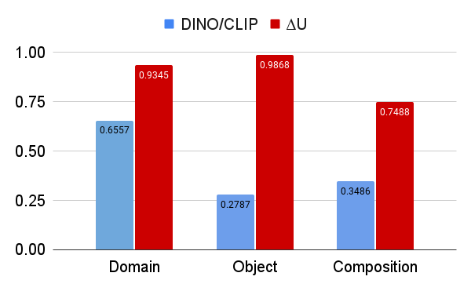

<div align="center">

# ConceptBed: Evaluations

[\[Project\]](https://conceptbed.github.io/)
[\[Paper\]](#)
[\[Data\]](https://conceptbed.github.io/data.html)
[\[Results Explorer\]](https://conceptbed.github.io/explorer.html)


</div>

## Description

This repository is the part of the "ConceptBed: Evaluating Concept Learning Abilities of Text-to-Image Diffusion Models" paper.

This project provides the evaluation framework for the Personalized Text-to-Image Generative models (also known as Concept Leanrers).


## Overview


## Getting Started

Install dependencies

```bash
# clone project
git clone https://github.com/ConceptBed/evaluations
cd evaluations

# [OPTIONAL] create conda environment
conda create -p ./venv python=3.8
conda activate ./venv

# install pytorch according to instructions
# https://pytorch.org/get-started/

# install requirements
pip install -r requirements.txt
```

Download the data and model checkpoints

```bash
bash ./scripts/download_data.sh
bash ./scripts/download_checkpoints.sh
```

Follow the below guidelines to store the generated images:

    <your-global-path>
    ├── ...
    ├── outputs                    # put the images anywhere
    │   ├── imagenet               # follow the downloaded conceptbed subset of imagenet folder
    │   │   ├── n01530575
    │   │   │   ├── 0.jpeg
    │   │   │   ├── 1.jpeg
    │   │   │   └── ...
    │   │   └── ...
    │   ├── pacs                   # follow the same folder structure as PACs
    │   │   ├── art_painting
    │   │   │   ├── dog
    │   │   │   │   ├── 0.jpeg
    │   │   │   │   ├── 1.jpeg
    │   │   │   │   ├── 2.jpeg
    │   │   │   │   └── ...
    │   │   │   └── ...
    │   │   └── ...
    │   ├── cub                    # follow the same folder structure as CUB
    │   │   ├── 001.Black_footed_Albatross
    │   │   │   ├── 0.jpeg
    │   │   │   ├── 1.jpeg
    │   │   │   └── ...
    │   │   └── ...
    │   └── compositions           # follow the downloaded conceptbed subset of imagenet folder
    │   │   ├── n01530575
    │   │   │   ├── 0_0.jpeg
    │   │   │   ├── 1_0.jpeg
    │   │   │   └── ...
    │   │   └── ...
    │   └── ...
    └── ...


Perform the ConceptBed (uncertainty-aware) evaluations:

1. Measure Concept Alignment

```bash
# evaluate on PACs subset
bash ./scripts/concept_alignment/test_pacs.sh

# evaluate on imagenet subset
bash ./scripts/concept_alignment/test_imagenet.sh

# evaluate on imagenet composition subset
bash ./scripts/concept_alignment/test_imagenet_composition.sh
```

2. Measure Composition Alignment

```bash
# evaluate the compositions 
bash ./scripts/composition_alignment/test_composition.sh
```

Additional instructions:
* Define the `gen_datapath` and `gen_name` in each bash script based on your setup.
* `test_imagenet_composition.sh` and `test_imagenet.sh` are essentially the same but you have to provide the path to the composition based generated images.


## Benchmark Results

### Human Performance
<!--  -->


### Concept Alignment


#### Uncertainty Sensitivity


### Composition Alignment


## Citation

If you our work helpful, please consider citing:

```
@article{patel2023conceptbed,
  author    = {Patel, Maitreya and Gokhale, Tejas and Baral, Chitta and Yang, Yezhou},
  title     = {ConceptBed: Evaluating Concept Learning Abilities of Text-to-Image Diffusion Models},
  journal={arXiv},
  year      = {2023},
}
```

## Acknowledgement
We would like to acknowledge the [PyTorch](https://pytorch.org), [timm](https://github.com/huggingface/pytorch-image-models), [transformers](https://github.com/huggingface/transformers), and [lightning+hydra](https://github.com/ashleve/lightning-hydra-template).

This work was supported by NSF RI grants #1750082 and #2132724, and a grant from Meta AI Learning Alliance. The views and opinions of the authors expressed herein do not necessarily state or reflect those of the funding agencies and employers.

If you have any questions or suggestions, please feel free to reach out to us.